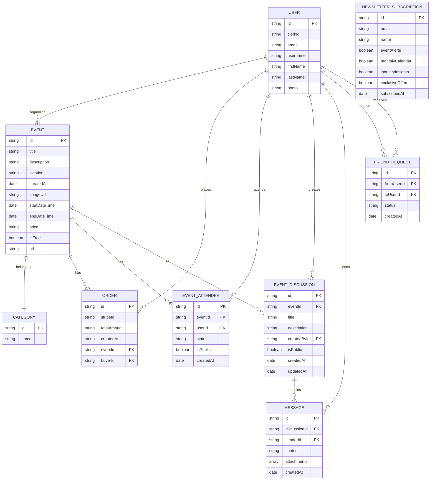
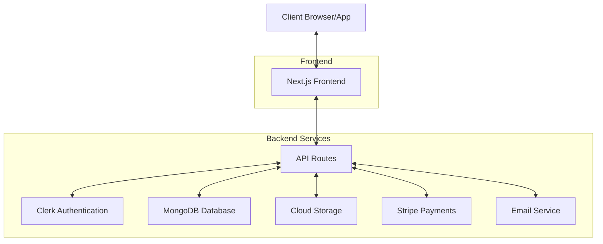

# System Design Documentation

## Entity Relationship Diagram

## System Architecture

## Database Schema Details

### User
- **id**: Unique identifier (MongoDB ObjectId)
- **clerkId**: External auth provider ID
- **email**: User's email address
- **username**: Unique username
- **firstName**: User's first name
- **lastName**: User's last name
- **photo**: URL to profile photo
- **friends**: Array of User IDs (references to other users)
- **friendRequests**: Array of friend request objects

### Event
- **id**: Unique identifier
- **title**: Event title
- **description**: Event description
- **location**: Physical or virtual location
- **createdAt**: Creation timestamp
- **imageUrl**: Event cover image
- **startDateTime**: Event start time
- **endDateTime**: Event end time
- **price**: Event price (if not free)
- **isFree**: Boolean indicating if event is free
- **url**: External URL (if applicable)
- **category**: Reference to Category
- **organizer**: Reference to User

### Category
- **id**: Unique identifier
- **name**: Category name

### Order
- **id**: Unique identifier
- **stripeId**: Stripe payment ID
- **totalAmount**: Payment amount
- **createdAt**: Order timestamp
- **event**: Reference to Event
- **buyer**: Reference to User

### EventAttendee
- **id**: Unique identifier
- **event**: Reference to Event
- **user**: Reference to User
- **status**: Attendance status (going/interested/not_going)
- **isPublic**: Whether attendance is publicly visible
- **createdAt**: Creation timestamp

### EventDiscussion
- **id**: Unique identifier
- **event**: Reference to Event
- **title**: Discussion title
- **description**: Discussion description
- **createdBy**: Reference to User
- **isPublic**: Whether discussion is public
- **participants**: Array of User IDs
- **messages**: Array of Message objects
- **createdAt**: Creation timestamp
- **updatedAt**: Last update timestamp

### Message
- **id**: Unique identifier
- **sender**: Reference to User
- **content**: Message text
- **attachments**: Array of attachment URLs
- **createdAt**: Timestamp

### FriendRequest
- **id**: Unique identifier
- **from**: Reference to User (sender)
- **to**: Reference to User (receiver)
- **status**: Request status (pending/accepted/rejected)
- **createdAt**: Timestamp

### NewsletterSubscription
- **id**: Unique identifier
- **email**: Subscriber email
- **name**: Subscriber name
- **preferences**: Subscription preferences
- **subscribedAt**: Subscription timestamp

## API Endpoints

### Authentication
- `/api/auth/*` - Clerk authentication endpoints

### Events
- `GET /api/events` - List events with filtering
- `GET /api/events/:id` - Get event details
- `POST /api/events` - Create new event
- `PUT /api/events/:id` - Update event
- `DELETE /api/events/:id` - Delete event

### Orders
- `POST /api/orders` - Create order
- `GET /api/orders/user/:userId` - Get user orders
- `GET /api/orders/event/:eventId` - Get event orders

### Social Features
- `POST /api/social/friend-request` - Send friend request
- `PUT /api/social/friend-request/:id` - Respond to friend request
- `GET /api/social/friends/:userId` - Get user's friends
- `POST /api/social/attendance` - Update event attendance
- `GET /api/social/attendance/:eventId` - Get event attendees
- `GET /api/social/friends-attending/:eventId` - Get friends attending event
- `POST /api/social/discussions` - Create discussion
- `GET /api/social/discussions/:eventId` - Get event discussions
- `POST /api/social/messages` - Add message to discussion
- `GET /api/social/messages/:discussionId` - Get discussion messages

### Newsletter
- `POST /api/newsletter/subscribe` - Subscribe to newsletter
- `PUT /api/newsletter/preferences` - Update subscription preferences
- `DELETE /api/newsletter/unsubscribe` - Unsubscribe from newsletter

## Technology Stack

- **Frontend**: Next.js, React, Tailwind CSS, Shadcn UI
- **Backend**: Next.js API Routes (Node.js)
- **Database**: MongoDB with Mongoose ODM
- **Authentication**: Clerk
- **File Storage**: Cloud storage (e.g., Cloudinary)
- **Payment Processing**: Stripe
- **Email Service**: SendGrid or similar
- **Deployment**: Vercel 